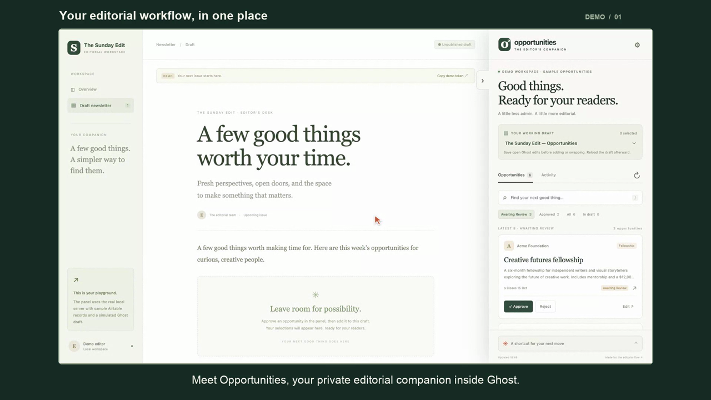
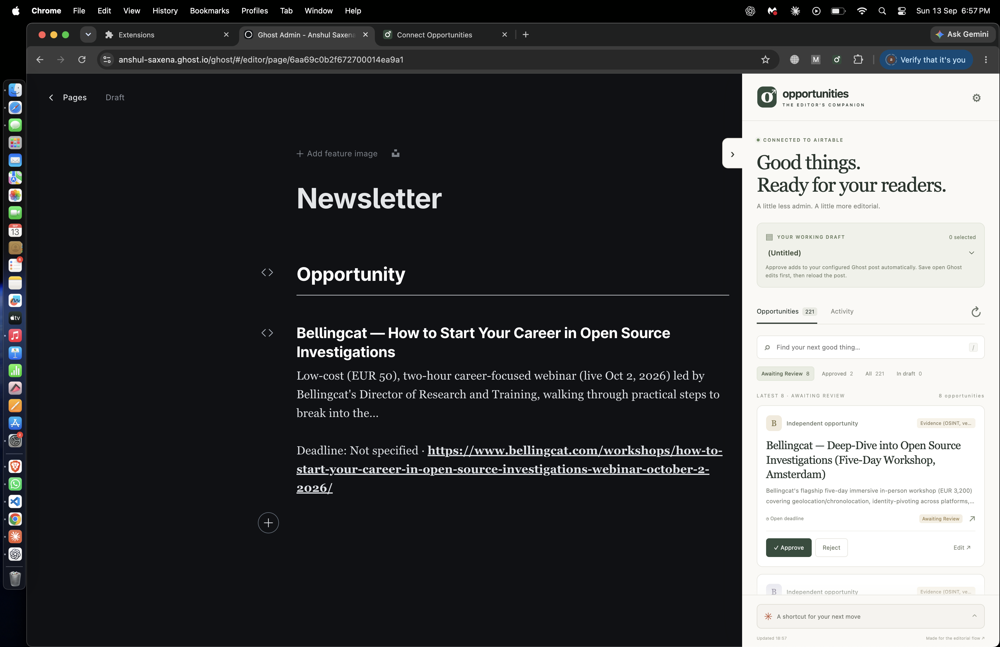
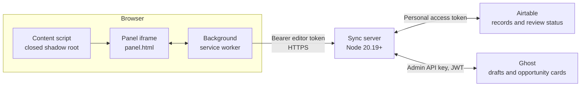

# Opportunities — Ghost Editorial Companion

A Manifest V3 browser extension and a small Node.js sync server that let editors review Airtable records, approve or reject opportunities, edit their content, and place dedicated opportunity cards into Ghost drafts — without leaving Ghost Admin.

The server owns the Airtable and Ghost credentials. The extension only ever receives a per-editor token and reaches the outside world through its background service worker.

---

## Demo

[](output/video/opportunities-demo-60s.mp4)

**▶︎ [Watch the 60-second demo](output/video/opportunities-demo-60s.mp4)** — 1920×1080, 30 fps, H.264/AAC. GitHub plays it inline when you open the file.

The walkthrough uses **sample demo data**, not a live Airtable base or Ghost site.

### Chapters

| Time | Chapter | What it shows |
| --- | --- | --- |
| 0:00 | Your editorial workflow, in one place | The panel docked beside a Ghost draft |
| 0:04 | Connect your workspace | Server address, Ghost site, and editor token; credentials stay server-side |
| 0:12 | Review the latest opportunities | Search, filter, check sources, approve, reject, reopen |
| 0:20 | Edit without leaving Ghost | Editing title, summary, deadline, category, and link back to Airtable |
| 0:27 | Build your newsletter draft | Adding an approved opportunity while preserving existing content |
| 0:35 | Swap a card, keep your edits | Replacing one card without disturbing other editorial content |
| 0:42 | Use a quick command | `reject Globex`, the review step, then confirmation |
| 0:48 | Stay in control | Activity feed, refresh, collapse, disconnect |
| 0:54 | One interface. One secure server. | How extension, server, Airtable, and Ghost fit together |

### Demo assets

| File | Purpose |
| --- | --- |
| [`opportunities-demo-60s.mp4`](output/video/opportunities-demo-60s.mp4) | Main demo, English voiceover |
| [`opportunities-demo-indian-english-60s.mp4`](output/video/opportunities-demo-indian-english-60s.mp4) | Same demo, Indian-English voiceover |
| [`opportunities-demo-poster.png`](output/video/opportunities-demo-poster.png) | Poster frame used above |

### Live run against real data

The video above uses sample data. Below is the same extension running against a **live** Airtable base and a real Ghost site — the panel docked inside Ghost Admin, with an approved opportunity already rendered into the Newsletter page.



Verified through the server API at the time of capture:

| Signal | Value |
| --- | --- |
| Airtable records | **221** — `unknown` 170, `pending` 48, `approved` 2, `rejected` 1 |
| Panel review queue | Latest **8** awaiting review |
| Ghost target | Page **"Newsletter"**, status `draft` |
| Opportunity cards embedded | **1** — `recIQ9zWAzGs2zyP6`, wrapped in `<!-- opp:… -->` / `<!-- /opp:… -->` |

The Airtable-to-Ghost round trip, from the activity feed and Ghost's own `updated_at`:

```text
13:27:39Z   Marked opportunity approved   recIQ9zWAzGs2zyP6   → Airtable status written
13:27:55Z   "Newsletter" page updated                         → Ghost card rendered
```

The approved record's title, truncated summary, deadline, and link appear in the Ghost page exactly as the server composed them:

> **Bellingcat — How to Start Your Career in Open Source Investigations**
>
> Low-cost (EUR 50), two-hour career-focused webinar (live Oct 2, 2026) led by Bellingcat's Director of Research and Training, walking through practical steps to break into the…
>
> Deadline: Not specified · `https://www.bellingcat.com/workshops/how-to-start-your-career-in-open-source-investigations-webinar-october-2-2026/`

Note the summary ending in `…` — that is the 180-character first-sentence cap described under [Validation and limits](#validation-and-limits), applied by the server at render time rather than stored truncated in Airtable.

---

## Contents

- [Live run against real data](#live-run-against-real-data)
- [How it fits together](#how-it-fits-together)
- [Try it locally](#try-it-locally)
- [Install the extension](#install-the-extension-in-chrome-or-edge)
- [Connect Airtable](#connect-airtable)
- [Connect Ghost drafts](#connect-ghost-drafts)
- [Editor commands](#editor-commands)
- [Automatic approval destination](#automatic-approval-destination)
- [API contract](#api-contract)
- [Validation and limits](#validation-and-limits)
- [Host the server](#host-the-server)
- [Security model](#security-model)
- [Scope and operational limits](#scope-and-operational-limits)
- [Verify and package](#verify-and-package)
- [Project layout](#project-layout)
- [Reference documentation](#reference-documentation)

---

## How it fits together



The panel is injected by [`extension/content.js`](extension/content.js) into a **closed** shadow root on Ghost Admin, so the host page cannot read or style it. All network calls are proxied through the background service worker — the panel never holds Airtable or Ghost credentials, only a short-lived editor token.

**Two-way flow.** Airtable is the source of record data and review status; Ghost is the destination for approved cards. Approving writes status back to Airtable, and adding or swapping rewrites only the opportunity cards inside a Ghost draft.

---

## Try it locally

Requires **Node.js 20.19+**. No npm dependencies and no build step.

```sh
npm start
```

Open **http://localhost:8787**. The demo contains six sample opportunities, a simulated newsletter draft, and the same panel and HTTP endpoints the extension uses. Changes persist in `data/state.json`, and the central draft preview updates as you add and swap opportunities.

Demo mode is loopback-only, never contacts Airtable or Ghost, and needs no credentials. To reset it, stop the server and rename `data/state.json` before restarting.

> **Do not reset a live server's state this way.** It holds audit and duplicate-request history.

---

## Install the extension in Chrome or Edge

1. Open `chrome://extensions` (or `edge://extensions`).
2. Enable **Developer mode**.
3. Choose **Load unpacked**, then select this repository's **`extension`** directory.
4. The connection settings page opens. For the demo, use:
   - Sync server URL: `http://localhost:8787`
   - Ghost Admin URL: `http://localhost:8787/mock-ghost/`
   - Editor access token: click **Copy demo token** in the local demo and paste it here.
5. Click **Save & test connection** and allow access to those local addresses.
6. Open **http://localhost:8787/mock-ghost/** and reload. This page omits the embedded preview panel so you can test the installed extension itself.
7. Pin the extension in your toolbar. Its icon, or the panel's edge handle, toggles the panel.

For a real Ghost instance, enter its Admin address (e.g. `https://your-publication.com/ghost/`) and your deployed sync server URL. Reload existing Ghost tabs after connecting or updating the extension. The content script is registered only for the configured Ghost origin and `/ghost/*` routes; the demo uses a separate `/mock-ghost/*` route.

**Token lifetime.** The token is held in `chrome.storage.session` and expires locally when the browser closes or the extension is reloaded — reconnect with your editor token afterwards. **Disconnect editor session** clears it immediately. Site addresses persist across browser sessions.

---

## Connect Airtable

Copy `.env.example` to `.env`, set `MODE=live`, and fill in:

```dotenv
MODE=live
AIRTABLE_TOKEN=your-personal-access-token
AIRTABLE_BASE_ID=appYourBase
AIRTABLE_TABLE_ID=tblYourTable
EDITOR_TOKENS={"editor@example.com":"your-random-editor-token"}
```

Generate each editor token locally:

```sh
node -e "console.log(require('crypto').randomBytes(32).toString('hex'))"
```

Keep Airtable and Ghost keys in the server environment. **Do not paste them into extension settings and do not commit `.env`.** Give each editor their own random token through your usual secure channel. To revoke access, remove that token from `EDITOR_TOKENS` and restart. To rotate it, replace it and hand the editor the replacement.

Create an Airtable personal access token with **`data.records:read`** and **`data.records:write`**, scoped to your base.

### Default schema

| Column | Airtable type | Purpose |
| --- | --- | --- |
| Title | Single line text | Opportunity title; required for edits |
| Organization | Single line text | Source organization |
| Summary | Long text | Newsletter copy |
| URL | URL | Opportunity link |
| Deadline | Date, without time | Application deadline |
| Category | Single line text | Fellowship, grant, residency, etc. |
| Status | Single select | `pending`, `approved`, `rejected` |

Create the Status options before connecting. Empty statuses appear as pending. Unrecognized values appear as unknown under **All**, and can still be approved or reopened.

### Mapping existing columns

```dotenv
AIRTABLE_FIELDS={"title":"Opportunity","organization":"Company","summary":"Description"}
AIRTABLE_STATUSES={"pending":"To review","approved":"Approved","rejected":"Rejected"}
```

Fields you do not override keep their defaults. Mapped content fields must return strings — use text fields rather than linked-record or multi-select arrays. The server paginates through all records. A visible panel refreshes once a minute, after a successful change, or when the editor clicks Refresh.

---

## Connect Ghost drafts

In Ghost Admin, create a **Custom Integration** and use its **Admin API key**, not the Content API key:

```dotenv
GHOST_URL=https://your-ghost-admin-origin.com
GHOST_ADMIN_KEY=integration-id:secret
```

Use the Admin origin with no `/ghost/` suffix, then restart the server. Existing unpublished drafts appear in the panel's draft selector. Ghost integration is optional — Airtable review works without it.

1. Approve an opportunity.
2. Select the intended newsletter draft.
3. **Save any unsaved Ghost editor changes.** Click **Add to draft** and confirm the named target.
4. Reload the Ghost draft after the write so its editor loads the new server revision.
5. To replace an item, approve its replacement, select **In draft**, then **Swap** on the original.

Each opportunity becomes a dedicated Ghost Lexical HTML card containing `<!-- opp:recordId -->` markers. The server preserves all other Lexical nodes, fetches the latest draft before writing, sends `updated_at`, and on a 409 conflict re-fetches and recomputes the change once. It refuses to update published or scheduled posts, and refuses a swap if the original card cannot be located safely.

> Existing cards are **not** automatically rewritten when Airtable content or approval status changes later.

---

## Editor commands

The panel footer provides a small, deterministic command parser:

- `approve Acme`
- `reject Stories that move us`
- `reopen recAcme`

Commands resolve an unambiguous title, organization, or record ID, and always show a preview for confirmation before anything changes.

> **This version does not include an LLM or a general natural-language agent.** These are fixed verb-plus-target commands, not conversational input. Use the form for content edits and the swap control for draft replacement.

---

## Automatic approval destination

`GHOST_APPROVAL_POST_ID` routes approvals made through the extension to one configured Ghost post or page:

```dotenv
GHOST_APPROVAL_POST_ID=your-ghost-post-or-page-id
GHOST_APPROVAL_RESOURCE=pages
```

`GHOST_APPROVAL_RESOURCE` accepts `posts` (default, for blog posts) or `pages` (Ghost Pages API).

That explicitly configured destination **may be published**: approval then updates the live page without sending a newsletter email. Every other route keeps draft-only protection.

Ghost is updated **before** Airtable becomes Approved. A failed Airtable write reports partial completion, and re-approving safely reconciles the already-marked card. Existing Airtable approvals, and approvals made directly in Airtable, are not backfilled or polled.

The server appends one Opportunity heading and divider, followed by each title, a whitespace-normalized first sentence capped at 180 characters, and the deadline plus URL. Missing deadlines display as Not specified. Save open Ghost editor changes before approving, and reload the post afterwards.

---

## API contract

All `/api` routes except the local demo bootstrap require `Authorization: Bearer <editor token>`. Send JSON for POST and PATCH. Mutating record and draft requests require a unique `Idempotency-Key`.

| Method | Route | Purpose |
| --- | --- | --- |
| GET | `/health` | Server liveness; no auth |
| GET | `/api/session` | Editor identity, mode, Ghost availability, approval destination |
| GET | `/api/opportunities` | Normalized records and revisions |
| PATCH | `/api/opportunities/:id` | `{ "fields": { "status": "approved" }, "revision": "..." }` |
| GET | `/api/drafts` | Up to 100 unpublished drafts and their opportunity IDs |
| POST | `/api/drafts/:id/add` | `{ "recordId": "rec..." }` |
| POST | `/api/drafts/:id/swap` | `{ "removeId": "rec...", "recordId": "rec..." }` |
| POST | `/api/commands/preview` | `{ "text": "approve Acme" }`; never writes |
| GET | `/api/activity` | 50 most recent editor actions through this server |
| POST | `/api/demo-session` | **Demo mode only.** Loopback-only token bootstrap |
| GET | `/api/demo-draft` | **Demo mode only.** Simulated draft for the local preview |

The activity feed records extension actions, not every change made directly in Airtable or Ghost. Approvals alter Airtable status. Draft operations alter Ghost; **they do not reject the removed Airtable record, and they do not maintain a one-to-one Airtable-to-draft link**, because one opportunity can appear in several drafts.

---

## Validation and limits

| Constraint | Value |
| --- | --- |
| Request body | 32 KB, else `413` |
| `Idempotency-Key` | 16–100 chars, `[A-Za-z0-9_-]`; UUID recommended |
| Title / Organization | 200 characters |
| Summary | 5 000 characters |
| URL | 2 000 characters |
| Deadline | Strict `YYYY-MM-DD` |
| Category | 100 characters |
| Approval card summary | First sentence, capped at 180 characters |
| Activity retained | 200 entries stored, 50 returned |
| Panel auto-refresh | Every 60 s while visible, idle, and connected |

Airtable updates use a pre-write revision check and PATCH only the changed fields. Record HTML is never rendered unchecked — the demo workspace reconstructs a small allowed subset of nodes.

---

## Host the server

The server is a standard long-running Node process; the extension connects to its HTTPS origin. Deployment is not performed by this repository.

1. Put the `server` directory and `package.json` on your host with Node 20.19+.
2. Configure the live environment variables, a persistent `DATA_DIR`, and `HOST=0.0.0.0` if binding inside a container or private network.
3. Run `npm start` under your process manager.
4. Put an HTTPS reverse proxy in front of port 8787. Route the whole API origin to this process, with request bodies limited to 32 KB and appropriate throttling. Check `GET /health` for liveness.
5. Enter that HTTPS origin and each editor's token in the extension settings, grant the requested host access, and reload Ghost Admin.

Use **one server process** with persistent disk for this initial version. Mutations are serialized within that process. A successful action and its replay response are persisted; a request whose result is uncertain is retained as unresolved, so a repeated key cannot silently perform it twice. Inspect the external record or draft after an uncertain error before submitting a new action. The panel never automatically retries a failed mutation.

---

## Security model

- **Credentials never reach the browser.** Airtable and Ghost keys live only in the server environment; the extension holds a per-editor bearer token in `chrome.storage.session`.
- **Least-privilege host access.** The manifest ships `optional_host_permissions`; the user grants the specific Ghost origin at connect time. The content script is registered dynamically for that origin only.
- **Panel isolation.** Injected into a closed shadow root, so Ghost's page scripts cannot reach into it.
- **Strict CSP** on extension pages: `script-src 'self'; object-src 'none'; base-uri 'none'`.
- **No wildcard CORS**, and no public live browser demo. Every workflow endpoint requires the bearer token.
- **Demo bootstrap is loopback-only** and additionally checks the request origin and an `X-Demo-Request` header.

Serve the server behind HTTPS and restrict the origin and network as appropriate for your team.

---

## Scope and operational limits

- This is an initial internal-team release, not a production deployment. Live adapters have contract tests; real Airtable and Ghost integration still needs a staging smoke test against your schema and Ghost version.
- Airtable offers no atomic compare-and-swap here, so concurrent direct Airtable edits can still race. The server serializes its own mutations but cannot lock external editors.
- No Ghost publish webhook, email-delivery reconciliation, notification service, distributed queue, SSO, roles, or conversational AI is included. Publishing remains in Ghost.
- Ghost's saved content is protected by `updated_at`; unsaved text in an open Ghost editor is invisible to the server. Save before syncing, reload afterwards.
- Supports Chrome and Edge, Manifest V3. Firefox packaging and enterprise distribution are not configured. Ghost UI changes can affect DOM injection — verify mounting and navigation on staging before upgrading Ghost.
- The panel is deliberately an overlay with a collapse handle. It does not modify Ghost's native editor layout or insert its interface into published content.

---

## Verify and package

```sh
npm run check
npm test
npm run package
```

- **`npm run check`** — verifies every JavaScript file parses and every manifest-referenced asset exists.
- **`npm test`** — Node's built-in test runner over loopback HTTP. Covers authentication, the full edit/approve/add/swap flow, stale revisions, concurrent writes, idempotency, persistence, input validation, safe HTML, command ambiguity, Airtable mapping and pagination, Ghost JWTs, and recomputing a Ghost update after a collision.
- **`npm run package`** — creates `dist/opportunities-extension.zip` containing extension files only (needs the standard `zip` command). Unzip and load that folder unpacked. Server credentials, demo state, tests, and backend code are never included.

---

## Project layout

```
extension/   Installable MV3 extension: panel UI, setup page,
             background network bridge, content-script mounting
server/      Authenticated API, Airtable and Ghost adapters,
             demo persistence, validation
demo/        Local editorial workspace hosting the real panel
tests/       Automated server, domain, and adapter coverage
scripts/     check and package helpers
output/      Demo video, captions, voiceover, poster,
             live screenshot
.env.example Configuration reference
```

---

## Reference documentation

- [Chrome extension cross-origin requests](https://developer.chrome.com/docs/extensions/develop/concepts/network-requests)
- [Chrome dynamically registered scripts](https://developer.chrome.com/docs/extensions/reference/api/scripting)
- [Airtable personal access tokens](https://support.airtable.com/articles/9934989703-creating-personal-access-tokens)
- [Ghost Lexical posts](https://docs.ghost.org/admin-api/posts/overview)
- [Ghost collision-safe post updates](https://docs.ghost.org/admin-api/posts/updating-a-post)

